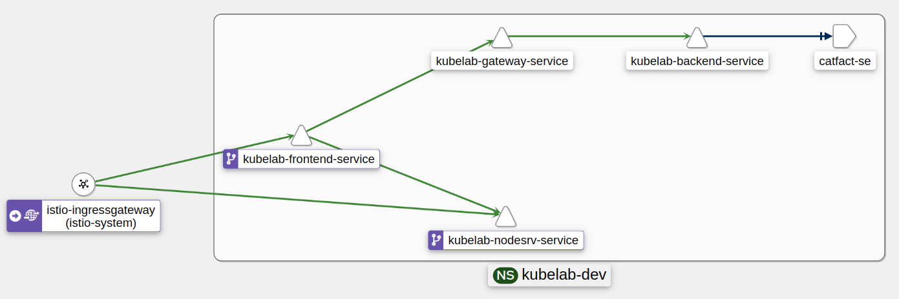

# Простая лаба на Kubernetes и Istio



## Состав лабы:

- бэк (java), имеет REST-endpoint, обращается к внешнему api, отвечает на запрос, добавляя информацию;
- шлюз (java), транслирует запрос от фронта к серверу, добавляя информацию на входе и выходе;
- фронт (статика на nginx, Vue.js), для выполнения запросов вручную;
- простой сервер на node.js для маршрутизации запросов средствами istio минуя nginx (доступен с /node);
- есть доступ как через ingress, так и через Istio gateway;

## Состав конфигурации kubernetes:

- 4 x Deployment - для фронта, шлюза, бэка, сервера на ноде;
- 3 x Service - для публикации фронта, шлюза, бэка, сервера на ноде внутри кластера;
- 2 x ConfigMap - для передачи настроек шлюзу и бэку;
- 1 x Secret - для передачи приватных настроек шлюзу;
- 1 x Ingress - для публикации фронта наружу (без istio и GKE);
- 1 x Gateway, 2 x VirtualService - для фронта и простого сервера
- 1 x ServiceEntry - для вызова внешнего сервера

## Запуск проекта:

- создать namespace и креды для docker registry

```shell script
kubectl create namespace kubelab-dev && \
kubectl label namespace kubelab-dev istio-injection=enabled && \
kubectl create secret docker-registry regcred \
  --docker-server=https://index.docker.io/v2/ \
  --docker-username=#### \
  --docker-password=######### \
  -n kubelab-dev && \
kubectl patch serviceaccount default \
  -p '{"imagePullSecrets": [{"name": "regcred"}]}' \
  -n kubelab-dev

kubectl get secret regcred -n kubelab-dev --output=yaml && \
kubectl get secret regcred -n kubelab-dev --output="jsonpath={.data.\.dockerconfigjson}" | base64 --decode && \
kubectl get serviceaccount default -n kubelab-dev --output=yaml
```

- установить чарты
    - backend
    - gateway + secret
    - nodesrv
    - frontend
    - istio

- запустить трафик

```shell
while true; do ./requester_istio.sh; sleep 5; done
# или
while true; do ./requester_ingress.sh; sleep 5; done
```
